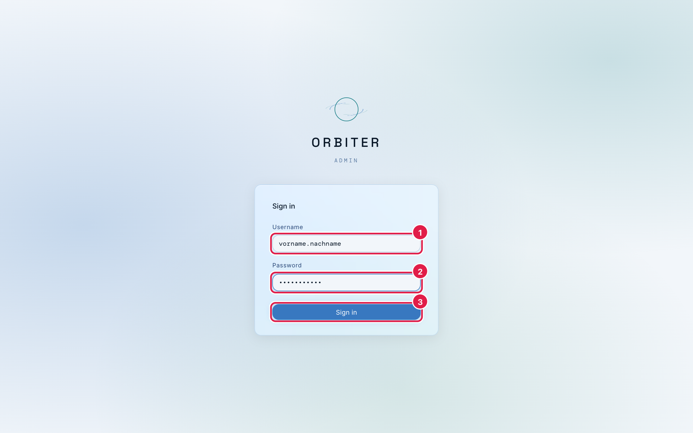
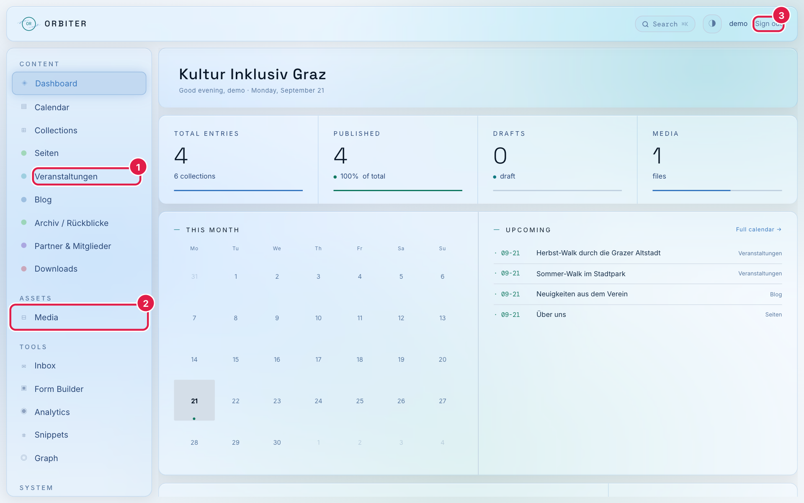
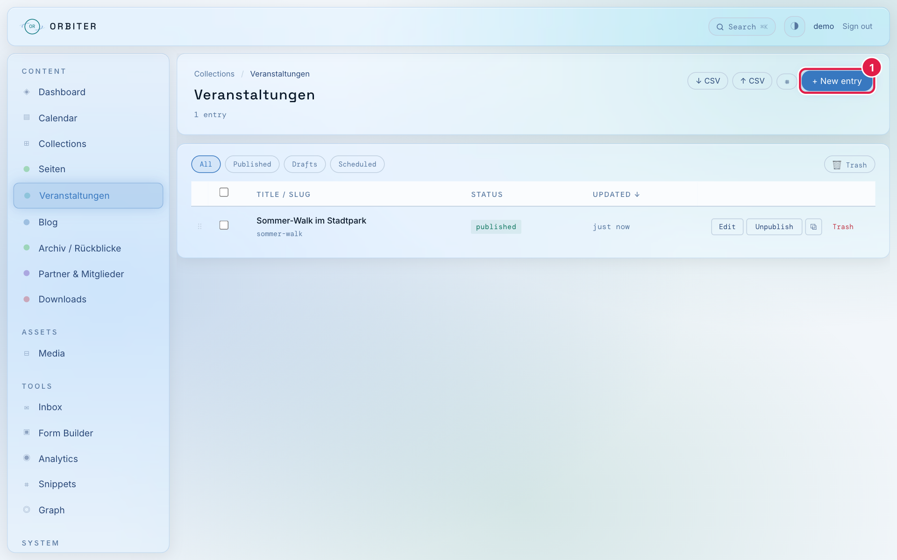
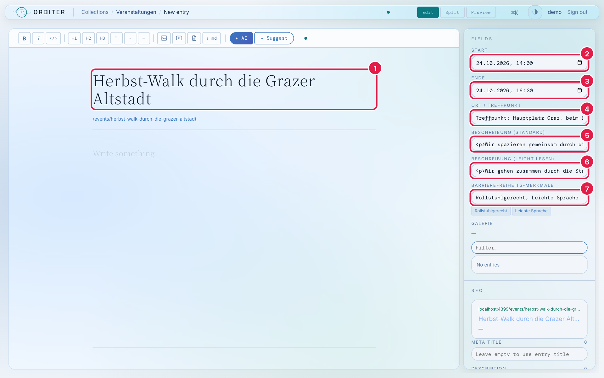
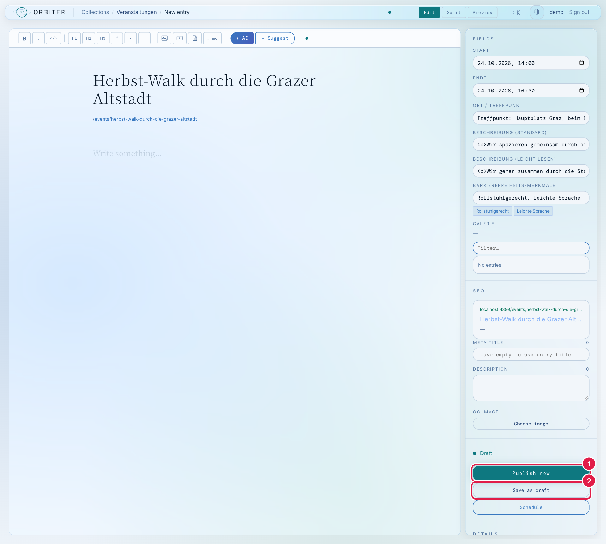
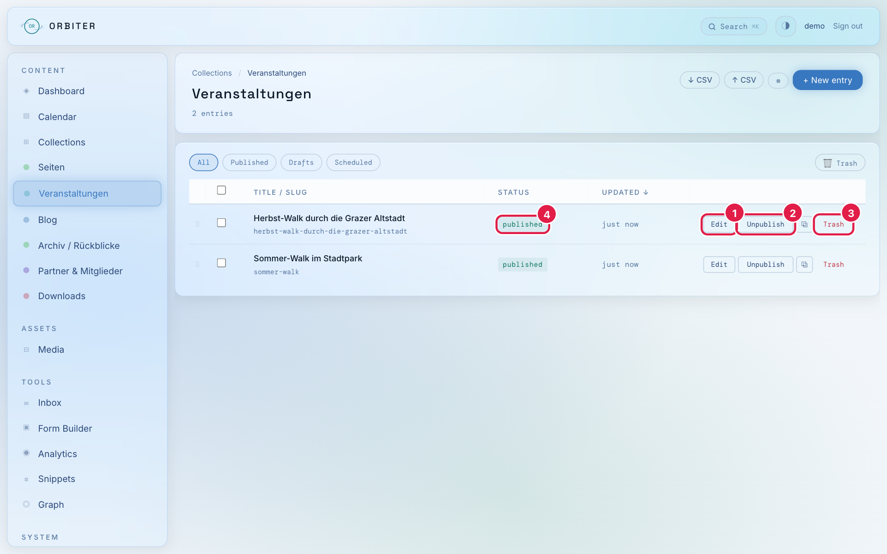
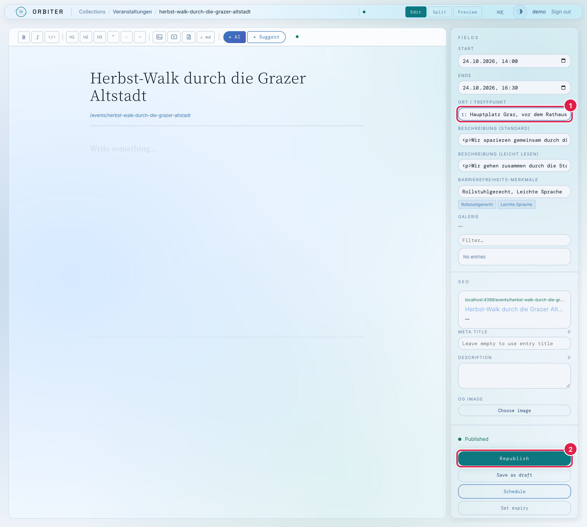
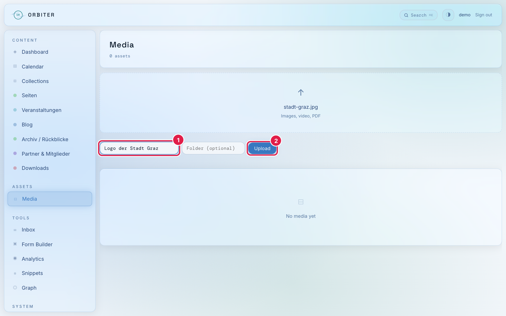
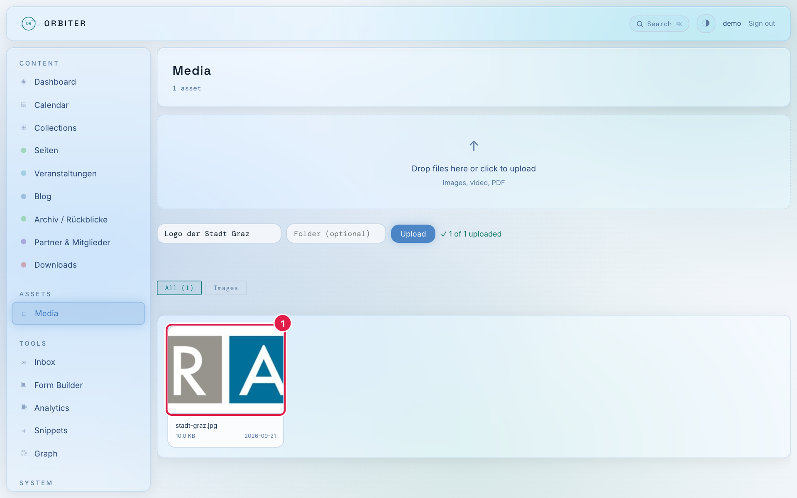
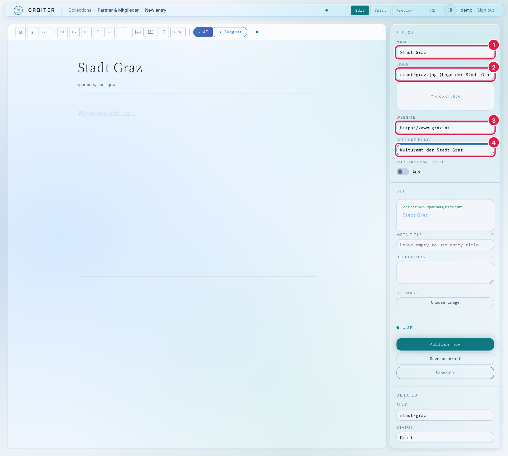

# Anleitung: Inhalte auf kuin.at ändern (Orbiter)

Diese Anleitung zeigt Schritt für Schritt, wie du Veranstaltungen, Blog-Beiträge, Partner-Logos
und andere Inhalte der Website **kuin.at** änderst. Dafür brauchst du keinen Code und kein Git –
alles läuft im Browser über **Orbiter**, das Redaktionssystem der Seite.

> **Wichtig:** Änderungen sind **sofort live**, sobald du sie veröffentlichst. Es gibt keinen
> Zwischenschritt und keine Vorschau-Freigabe. Lies deshalb vor dem Klick auf „Publish now" /
> „Republish" noch einmal über deinen Text.

Die Screenshots stammen aus einer Demo-Version mit Beispieldaten. Bei dir sind mehr Einträge
vorhanden, das Aussehen ist aber identisch. Die Oberfläche von Orbiter ist auf **Englisch**,
die Namen der Bereiche (Veranstaltungen, Partner …) sind deutsch.

## Inhalt

1. [Einloggen](#1-einloggen)
2. [Orientierung: Was steckt wo?](#2-orientierung-was-steckt-wo)
3. [Neue Veranstaltung anlegen](#3-neue-veranstaltung-anlegen)
4. [Veröffentlichen, offline nehmen, löschen](#4-veröffentlichen-offline-nehmen-löschen)
5. [Bestehenden Eintrag ändern](#5-bestehenden-eintrag-ändern)
6. [Bilder hochladen (mit Alt-Text)](#6-bilder-hochladen-mit-alt-text)
7. [Bild einem Eintrag zuordnen (Beispiel Partner-Logo)](#7-bild-einem-eintrag-zuordnen-beispiel-partner-logo)
8. [Texte formatieren (HTML-Spickzettel)](#8-texte-formatieren-html-spickzettel)
9. [„Leicht Lesen"-Texte](#9-leicht-lesen-texte)
10. [Regeln und Stolperfallen](#10-regeln-und-stolperfallen)
11. [Wenn etwas nicht klappt](#11-wenn-etwas-nicht-klappt)

---

## 1. Einloggen

1. Öffne im Browser **<https://api.kuin.at>**. Du landest automatisch auf der Anmeldeseite.
2. Gib deinen **Username** (1) und dein **Password** (2) ein und klicke auf **Sign in** (3).

Deine Zugangsdaten bekommst du von Gerwin. Sie stehen bewusst nicht in dieser Anleitung.



Zum Abmelden klickst du oben rechts auf **Sign out**.

---

## 2. Orientierung: Was steckt wo?

Nach dem Login siehst du das **Dashboard**. Links ist das Menü. Für die tägliche Arbeit brauchst du nur
zwei Bereiche:

1. **Die Bereiche unter „Content"** – hier liegen die Inhalte (z. B. **Veranstaltungen**).
2. **Media** (2) – hier liegen alle hochgeladenen Bilder und PDFs.

Alles andere im Menü (Calendar, Analytics, Snippets, Graph, Schema, Build, Users, Pods …) kannst du
**ignorieren** und solltest du nicht verändern – besonders nicht unter „System".



**Welcher Bereich steuert welche Stelle der Website?**

| Bereich im Menü | Was ist das? | Wo erscheint es auf kuin.at? |
|---|---|---|
| **Seiten** | Textseiten wie „Über uns", Manifest, Kontakt, Barrierefreiheit | Jeweils unter `kuin.at/<seitenname>` |
| **Veranstaltungen** | Walks, Workshops, Konferenzen | Seite „Events", Startseite (nächste Veranstaltung) |
| **Blog** | Newsletter und Neuigkeiten | Seite „Aktuell" → „Newsletter" (`kuin.at/blog`) |
| **Archiv / Rückblicke** | Jahresgalerien vergangener Walks | Seite „Archiv" |
| **Partner & Mitglieder** | Partner-Organisationen mit Logo | Seite „Partner" und Startseite |
| **Downloads** | PDFs zum Herunterladen, z. B. Jahresberichte | Seiten „Downloads" und „Archiv". Kategorie `jahresbericht` = erscheint bei den Jahresberichten, alles andere unter „Sonstiges". |
| **Personen** (falls vorhanden) | Vorstand und Team mit Foto | „Der Verein" → Vorstand / Team |

---

## 3. Neue Veranstaltung anlegen

Beispiel: ein neuer Walk. Für Blog-Beiträge, Seiten usw. funktioniert es genauso, nur die Felder sind andere.

**Schritt 1:** Klicke im Menü auf **Veranstaltungen**. Du siehst die Liste aller Veranstaltungen.
Klicke oben rechts auf **+ New entry** (1).



**Schritt 2:** Es öffnet sich der Editor. Fülle die Felder aus:

| Nr. | Feld | Was hineingehört |
|---|---|---|
| 1 | **Große Überschrift oben** | Titel der Veranstaltung. Daraus entsteht auch die Web-Adresse (`/events/…`). |
| 2 | **Start** | Datum und Uhrzeit des Beginns (auf das Kalender-Symbol klicken oder tippen). |
| 3 | **Ende** | Datum und Uhrzeit des Endes. Muss **nach** dem Start liegen. |
| 4 | **Ort / Treffpunkt** | Adresse oder Treffpunkt, so genau wie möglich. |
| 5 | **Beschreibung (Standard)** | Der normale Text. Siehe [HTML-Spickzettel](#8-texte-formatieren-html-spickzettel). |
| 6 | **Beschreibung (Leicht Lesen)** | Dieselbe Info in einfacher Sprache. Siehe [Abschnitt 9](#9-leicht-lesen-texte). |
| 7 | **Barrierefreiheits-Merkmale** | Stichworte mit Komma getrennt, z. B. `Rollstuhlgerecht, Gebärdensprache`. Darunter erscheinen sie als kleine Etiketten. |

Die große Fläche mit „Write something…" in der Mitte bleibt **leer** – sie wird bei diesen Bereichen
nicht verwendet. Alle Texte gehören in die Felder rechts.



Das Feld **Galerie** kannst du leer lassen. Der Bereich **SEO** weiter unten ebenfalls.

---

## 4. Veröffentlichen, offline nehmen, löschen

Ganz unten in der rechten Spalte stehen die Buttons. Dafür ggf. mit der Maus in der Spalte nach unten scrollen.



| Nr. | Button | Bedeutung |
|---|---|---|
| 1 | **Publish now** | Der Eintrag ist **sofort auf kuin.at sichtbar**. |
| 2 | **Save as draft** | Speichert als **Entwurf**. Auf der Website ist er **nicht** sichtbar. Gut, wenn du später weiterarbeiten willst. |
| – | **Schedule** | Veröffentlichung zu einem festgelegten Zeitpunkt. Nur nutzen, wenn du das wirklich brauchst. |

Nach dem Veröffentlichen findest du den Eintrag in der Liste. In der Spalte **STATUS** (4) steht
`published` (sichtbar) oder `draft` (Entwurf). Rechts in der Zeile stehen drei Aktionen:



| Nr. | Aktion | Bedeutung |
|---|---|---|
| 1 | **Edit** | Eintrag öffnen und ändern. |
| 2 | **Unpublish** | Eintrag **von der Website nehmen**, ohne ihn zu löschen. Später wieder veröffentlichbar. |
| 3 | **Trash** | Eintrag in den Papierkorb legen. Den Papierkorb erreichst du über den Button **Trash** oben rechts über der Liste. |

> **Tipp:** Im Zweifel lieber **Unpublish** statt Trash. Dann geht nichts verloren.

Mit den Filtern **All / Published / Drafts / Scheduled** über der Liste findest du schnell, was gerade
live ist und was noch Entwurf.

---

## 5. Bestehenden Eintrag ändern

1. Menü → passender Bereich (z. B. **Veranstaltungen**) → in der Zeile auf **Edit** klicken.
2. Ändere das Feld (1), z. B. den Treffpunkt.
3. Klicke unten rechts auf **Republish** (2).



> ⚠️ **Der häufigste Fehler:** Oben im Editor steht nach kurzer Zeit „Saved". Das ist nur eine
> **Zwischenspeicherung** – auf der Website ist die Änderung damit **noch nicht sichtbar**.
> **Erst der Klick auf „Republish"** (bei neuen Einträgen „Publish now") schaltet die Änderung live.
> Wenn du die Seite verlässt, ohne zu klicken, ist deine Änderung nicht veröffentlicht.

Bei bereits veröffentlichten Einträgen heißt der grüne Button **Republish**, bei neuen **Publish now**.

**Prüfen:** Öffne danach die entsprechende Seite auf <https://kuin.at> und lade sie neu
(Mac: `Cmd + R`, Windows: `Strg + R`). Die Änderung sollte sofort zu sehen sein.

---

## 6. Bilder hochladen (mit Alt-Text)

Bilder und PDFs werden zuerst in die **Media**-Bibliothek hochgeladen und dann in Einträgen ausgewählt.

1. Menü → **Media**.
2. Trage bei **Alt text** (1) eine kurze Beschreibung des Bildes ein (siehe Kasten unten).
3. Ziehe die Datei in das gestrichelte Feld **oder** klicke hinein und wähle die Datei aus.
   Der Dateiname erscheint im Feld.
4. Klicke auf **Upload** (2).



Nach dem Upload erscheint das Bild unten in der Bibliothek (1) und der Hinweis „1 of 1 uploaded".



> **Alt-Text ist Pflicht.** Die Website soll barrierefrei sein: Screenreader lesen den Alt-Text
> blinden und sehbehinderten Menschen vor. Beschreibe kurz, **was man sieht bzw. worum es geht**:
>
> - ✅ „Logo der Oper Graz" · „Gruppe von Menschen mit Rollstuhl im Stadtpark"
> - ❌ „Bild1" · „IMG_2044.jpg" · „Foto"
>
> Der Alt-Text steht später im Auswahlfeld hinter dem Dateinamen – daran erkennst du das richtige Bild.

**Dateitipps:** Logos möglichst als **SVG** oder PNG. Fotos vorher verkleinern (z. B. maximal
2000 Pixel Breite), damit die Seite schnell bleibt. Vermeide Sonderzeichen und Leerzeichen im Dateinamen.

---

## 7. Bild einem Eintrag zuordnen (Beispiel Partner-Logo)

1. Menü → **Partner & Mitglieder** → **+ New entry**.
2. Fülle rechts die Felder aus:
   1. **Name** – Name der Organisation, **so wie er auf der Website stehen soll**.
   2. **Logo** – Bild aus der Media-Bibliothek auswählen (bei Punkt 6 hochgeladen). Das Bild erscheint darunter als Vorschau.
   3. **Website** – Adresse mit `https://…`.
   4. **Beschreibung** – ein kurzer Satz.
3. **Vorstandsmitglied** nur einschalten, wenn die Organisation im Vorstand vertreten ist.
4. Oben in der großen Überschrift zusätzlich denselben Namen eintragen (daraus entsteht die interne Adresse).
5. Unten **Publish now** klicken.



> **Merke:** Bei **Partner & Mitglieder** (und Personen) ist das Feld **Name** in der rechten Spalte
> das, was auf der Website angezeigt wird – nicht die große Überschrift oben.

Das Logo-Feld ist **Pflicht**. Ohne Logo wird der Eintrag auf der Website nicht angezeigt.

Genauso funktioniert das **Titelbild** bei Blog-Beiträgen und die **Datei** bei Downloads.

---

## 8. Texte formatieren (HTML-Spickzettel)

Die Textfelder (Beschreibung, Inhalt …) sind **einzeilige Felder, in denen HTML steht**. Das sieht
im ersten Moment technisch aus, ist aber einfach: Der eigentliche Text steht zwischen kleinen
„Klammern" (Tags). Du änderst nur den Text dazwischen.

```html
<p>Wir spazieren gemeinsam durch die Grazer Altstadt.</p>
```

**Die wichtigsten Bausteine:**

| Was du willst | So schreibst du es |
|---|---|
| Absatz | `<p>Dein Text.</p>` |
| Mehrere Absätze | `<p>Erster Absatz.</p><p>Zweiter Absatz.</p>` |
| **Fett** | `<strong>wichtig</strong>` |
| *Kursiv* | `<em>betont</em>` |
| Zwischenüberschrift | `<h2>Anmeldung</h2>` |
| Link | `<a href="https://kuin.at/events">Alle Veranstaltungen</a>` |
| E-Mail-Link | `<a href="mailto:office@kuin.at">office@kuin.at</a>` |
| Aufzählung | `<ul><li>Erster Punkt</li><li>Zweiter Punkt</li></ul>` |

**Goldene Regeln:**

- Jedes `<…>` braucht sein Gegenstück `</…>` (`<p>` … `</p>`).
- Text ohne Tags einfach zu tippen ist möglich, aber unschön formatiert – nimm mindestens `<p>…</p>`.
- Lösche beim Ändern **nie** versehentlich ein `<` oder `>`. Ändere nur den Text dazwischen.
- Längere Texte lassen sich in dem schmalen Feld schlecht bearbeiten. Schreibe sie lieber in einem
  Texteditor (Notizen, TextEdit im Nur-Text-Modus) und füge sie dann per Copy & Paste ein.
- Bei bestehenden Texten: Klicke ins Feld, wähle alles (`Cmd + A` / `Strg + A`), kopiere es in einen
  Texteditor, ändere es dort und füge es wieder ein.
- Bilder in Fließtexten und ähnliche Sonderfälle bitte mit Gerwin abstimmen.

---

## 9. „Leicht Lesen"-Texte

kuin.at hat oben einen Schalter **„Leicht Lesen"**. Wenn Besucher:innen ihn aktivieren, zeigt die
Seite statt des Standardtexts den Text aus dem Feld **… (Leicht Lesen)**.

Deshalb gilt: **Wenn du einen Standardtext änderst, ändere auch den Leicht-Lesen-Text.** Sonst
stimmen die beiden Versionen nicht mehr überein.

Grundregeln für Leichte Sprache:

- **Kurze Sätze**, ein Gedanke pro Satz.
- **Einfache Wörter.** Fremdwörter vermeiden oder erklären.
- **Keine Verneinungen** und keine Fachbegriffe, wenn es geht.
- Wichtiges konkret nennen: **Wann? Wo? Was?**
- Beispiel: *Standard:* „Wir spazieren gemeinsam durch die Grazer Altstadt." →
  *Leicht Lesen:* „Wir gehen zusammen durch die Stadt. Der Weg ist leicht."

Das Leicht-Lesen-Feld ist optional. Ist es leer, wird der Standardtext angezeigt.

---

## 10. Regeln und Stolperfallen

- **Erst prüfen, dann veröffentlichen.** Alles ist sofort live. Für unfertige Sachen: **Save as draft**.
- **Nach jeder Änderung an einem bestehenden Eintrag auf „Republish" klicken** (siehe Abschnitt 5).
- **Slug nicht ändern.** Der „Slug" (Feld unter *Details*, z. B. `herbst-walk`) ist Teil der Web-Adresse.
  Wird er bei einem veröffentlichten Eintrag geändert, funktionieren alte Links nicht mehr.
- **Pflichtfelder ausfüllen.** Titel, Start/Ende, Ort und Standard-Beschreibung bei Veranstaltungen;
  Titel, Datum und Standard-Text beim Blog; Name und Logo bei Partnern; Titel und Datei bei Downloads.
  Fehlt etwas Wichtiges, wird der Eintrag auf der Website übersprungen.
- **Immer Alt-Text** beim Bild-Upload.
- **Archiv / Rückblicke: Feld „Bilder" nicht anfassen.** Dort steht eine technische Bilderliste, die
  sich in Orbiter nur unhandlich bearbeiten lässt. Neue Galerien oder Änderungen bitte mit Gerwin abstimmen.
- **Nichts löschen, was du nicht kennst.** Im Zweifel **Unpublish** statt **Trash**.
- **Bereiche unter „System"** (Schema, Build, Settings, Users, Pods, Publish HTML …) nicht verändern.

---

## 11. Wenn etwas nicht klappt

| Problem | Lösung |
|---|---|
| Ich sehe meine Änderung auf kuin.at nicht | Hast du **Republish / Publish now** geklickt? Dann die Seite mit `Cmd + Shift + R` (Mac) bzw. `Strg + F5` (Windows) neu laden. |
| Der Eintrag erscheint gar nicht auf der Website | Steht der Status auf `published`? Sind alle Pflichtfelder ausgefüllt (siehe Abschnitt 10)? |
| Ich habe mich ausgeloggt / die Seite lässt mich nicht mehr rein | Neu einloggen unter <https://api.kuin.at>. Passwort vergessen: Gerwin fragen. |
| Meine Änderung ist weg | Ist der Eintrag im Papierkorb (**Trash**-Button in der Liste)? Wenn nicht: Gerwin Bescheid geben, möglichst mit Uhrzeit und Name des Eintrags. |
| Das Bild wird auf der Website nicht angezeigt | Ist im Eintrag ein Bild ausgewählt? Ist der Eintrag veröffentlicht? Ist die Datei ein normales Bildformat (JPG, PNG, SVG, WebP)? |
| Sonst irgendetwas Komisches | Nichts weiter anklicken, einen Screenshot machen und Gerwin schicken. |

**Ansprechperson:** Gerwin (Gerwin Weiher, <gerwin.weiher@gmail.com>)
